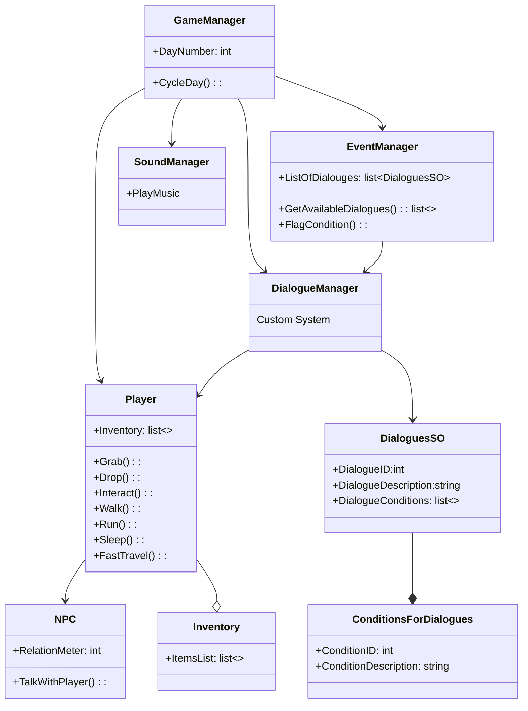

```mermaid
classDiagram
	class Player {
		+Inventory: list<>
		+Grab(): 
		+Drop():
		+Interact():
		+Walk():
		+Run():
		+Sleep():
		+FastTravel():
    }

    class NPC {
        +RelationMeter: int
        +TalkWithPlayer():
    }

    class EventManager {
        +ListOfDialouges: list~DialoguesSO~
        +GetAvailableDialogues(): list<>
        +FlagCondition():
    }
    class GameManager{
	    +DayNumber: int
	    +CycleDay():
    }
    class SoundManager{
	    +PlayMusic
    }
    class DialogueManager{
    Custom System
    }
    class DialoguesSO{
	    +DialogueID:int
	    +DialogueDescription:string
	    +DialogueConditions: list<>
    }
    class ConditionsForDialogues{
	    +ConditionID: int
	    +ConditionDescription: string
    }
    class Inventory{
	    +ItemsList: list<>
    }
	GameManager --> Player
	Player --> NPC
	Player --o Inventory
	GameManager --> SoundManager
	GameManager --> DialogueManager
	DialogueManager --> DialoguesSO
	DialoguesSO --* ConditionsForDialogues
	GameManager --> EventManager
	EventManager --> DialogueManager
	DialogueManager --> Player
	


```